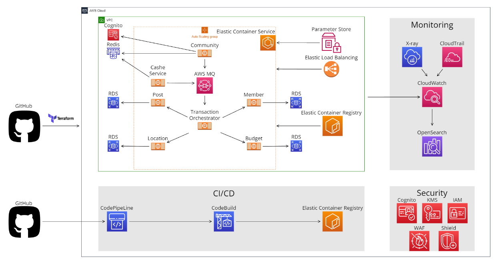
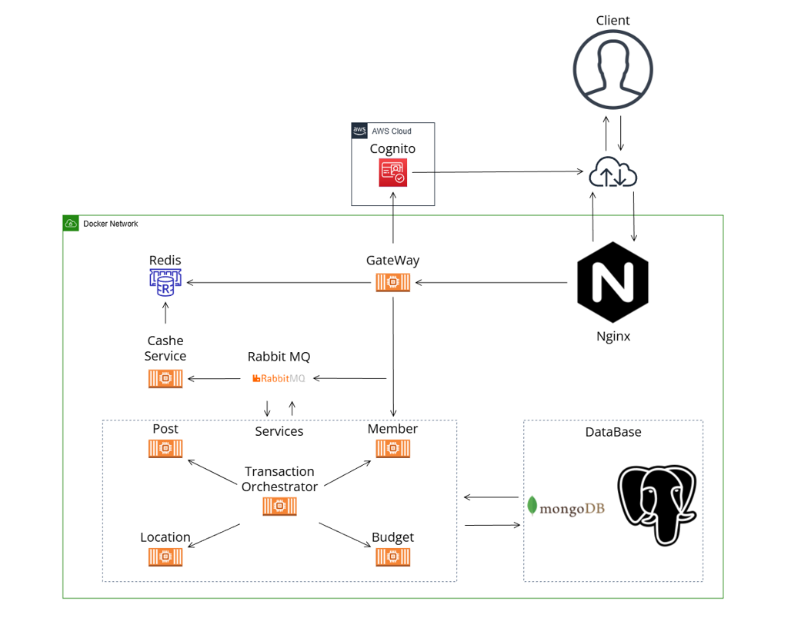

# AWS_Free_Tier_Microservice
여행관리 앱을 위한 백엔드 서비스 구현

# 계획
AWS 프리티어를 통해 단 8시간만 운영되면 되는 서버를 구현 합니다.

기존 (전체 프리티어 서비스)



변경 (Docker-Compose)  
주요기술: Java, Spring Boot, Nginx, Docker, Docker-Compose


# 실행방법
```bash
   git clone https://github.com/jth0809/AWS_Free_Tier_Microservice.git
   cd AWS_Free_Tier_Microservice
   docker-compose up
```


### 향후방향
쿠버네티스 전환  
https://github.com/jth0809/Devops_Automation_K8s

캐시 서비스 제작

RabbitMQ로 전달된 내용의 검증

## 문제해결
AWS 프리티어의 EBS 볼륨 용량 제한 문제  

Docker-Compose / 온프레미스 환경으로 전환

모바일과 데이터 연동 문제

모바일 프론트엔드의 데이터구조 역추적으로 코드 및 데이터 구조 재구성

모바일 프로젝트 Github:  
https://github.com/1971309590/System-Project

# 데모영상
https://youtu.be/J1Fld_Swps8
